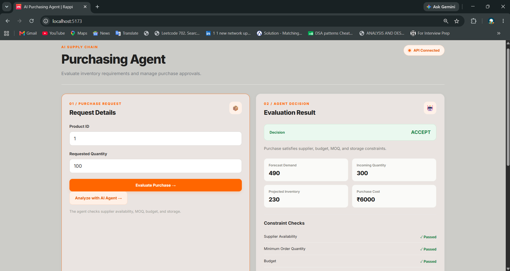
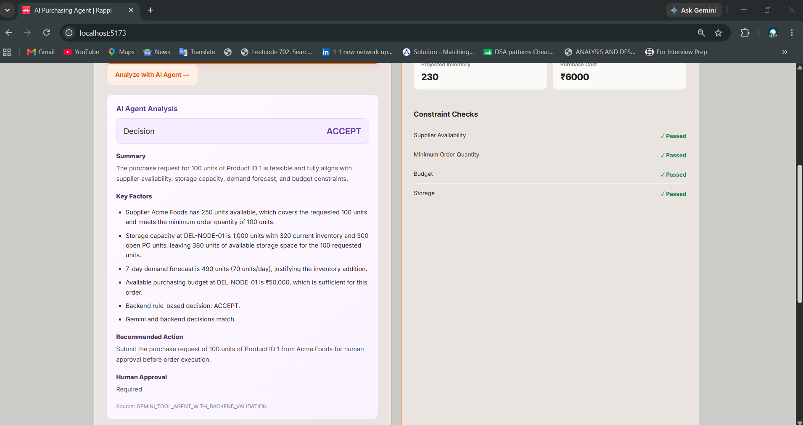
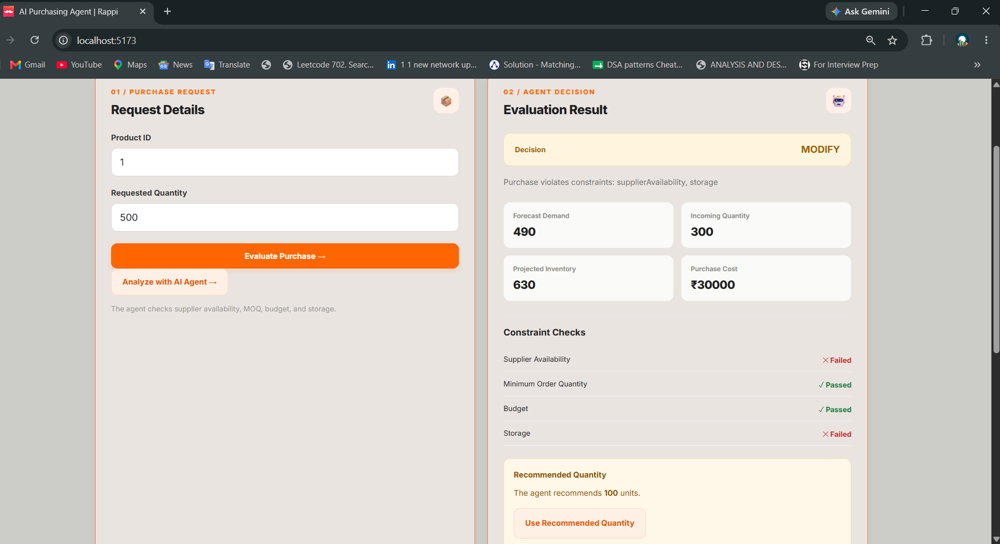
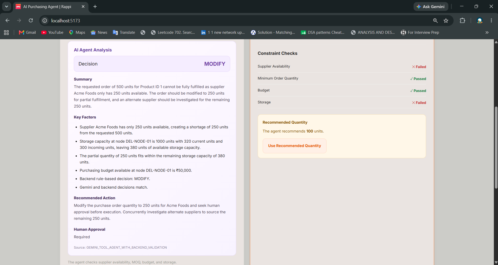
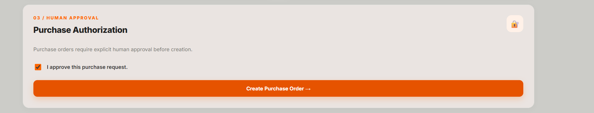
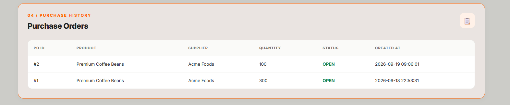
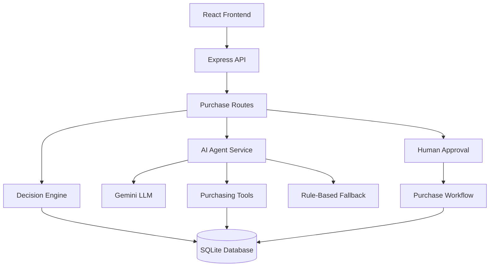

# AI Purchasing Agent

An AI-assisted purchasing decision system for retail and quick-commerce operations. The system evaluates purchase requests against inventory, supplier availability, demand forecasts, budget, minimum order quantity, and storage constraints.

It combines rule-based backend validation with an AI agent workflow and requires human approval before creating purchase orders.

## Features

- Purchase request evaluation
- Supplier availability validation
- Demand forecast analysis
- Open purchase order tracking
- Budget and storage constraint checks
- AI-assisted purchasing recommendations
- Fallback decision-making when the AI service is unavailable
- Human approval before purchase order creation
- Purchase order history
- Backend validation of purchase requests

## Tech Stack

### Frontend
- React
- Vite
- CSS

### Backend
- Node.js
- Express.js
- SQLite
- better-sqlite3
- Zod

### AI
- Google Gemini API
- Tool-based purchasing agent workflow
- Rule-based fallback validation

## Project Structure

```text
ai-purchasing-agent/
│
├── client/
│   └── src/
│       ├── App.jsx
│       ├── App.css
│       └── main.jsx
│
├── server/
│   ├── .env.example
│   ├── package.json
│   └── src/
│       ├── index.js
│       ├── db/
│       │   ├── database.js
│       │   └── seed.js
│       ├── routes/
│       │   ├── products.js
│       │   └── purchase.js
│       └── agent/
│           ├── tools.js
│           ├── gemini-tools.js
│           ├── llm-service.js
│           ├── tool-agent-service.js
│           ├── purchase-workflow.js
│           └── decision-engine.js
│
└── README.md
```

## Getting Started

### 1. Clone the repository

```bash
git clone <your-repository-url>
cd ai-purchasing-agent
```

### 2. Install frontend dependencies

```bash
cd client
npm install
```

### 3. Install backend dependencies

Open another terminal:

```bash
cd server
npm install
```

### 4. Configure environment variables

Create a `.env` file inside the `server` directory:

```env
PORT=5000
GEMINI_API_KEY=your_gemini_api_key_here
```

Do not commit your actual API key.

### 5. Seed the database

From the project root:

```bash
node server/src/db/seed.js
```

### 6. Start the backend

```bash
cd server
npm run dev
```

The backend runs at:

```text
http://localhost:5000
```

### 7. Start the frontend

Open another terminal:

```bash
cd client
npm run dev
```

Open the local frontend URL shown by Vite.

## Workflow

1. User enters a product ID and requested quantity.
2. Backend retrieves operational data from SQLite.
3. The decision engine checks purchasing constraints.
4. The system generates an ACCEPT, MODIFY, REJECT, or INVESTIGATE decision.
5. The AI agent provides an explanation and recommended action.
6. The user reviews the recommendation.
7. Explicit human approval is required.
8. The backend validates the request again before creating a purchase order.
9. The created purchase order appears in purchase history.

## Constraint Checks

The system evaluates:

- Supplier availability
- Minimum order quantity
- Budget availability
- Storage capacity
- Existing inventory
- Demand forecast
- Incoming purchase orders


## Application Screenshots

### Valid Purchase


### AI Evaluation


### Supplier Shortage


### AI Supplier Shortage Analysis


### Human Approval


### Purchase Order



## Test Scenarios

### Scenario 1: Valid Purchase

- Requested quantity: 100
- Expected decision: ACCEPT
- All purchasing constraints should pass.

### Scenario 2: Supplier Shortage

- Requested quantity: 500
- Supplier availability: 250
- Expected decision: MODIFY
- The system should identify the supplier shortage and recommend alternate sourcing or a reduced quantity.

### Scenario 3: Storage Constraint

- Request a quantity that exceeds available storage capacity.
- Expected decision: MODIFY or INVESTIGATE.
- The system should not blindly create an invalid purchase order.

### Scenario 4: Human Approval

- Submit a valid purchase request.
- Attempt to create an order without checking the approval box.
- Expected result: The request is blocked.
- Check the approval box and submit again.
- Expected result: The purchase order is created after backend validation.

## AI Agent Safety

The AI agent does not independently create purchase orders.

The system uses:

- Backend constraint validation
- Structured decision responses
- Human approval
- Final purchase workflow validation
- Rule-based fallback when the AI service is unavailable

The fallback ensures that purchasing decisions can still be evaluated using backend business rules.

## Limitations

- The project currently uses mock operational data stored in SQLite.
- Supplier and inventory updates are not connected to external production systems.
- AI availability depends on the configured Gemini API quota and service availability.
- The fallback decision engine is used when the AI service cannot respond.

## Future Improvements

- Support multiple suppliers and sourcing allocation
- Add authentication and role-based access
- Add purchase order cancellation and tracking
- Integrate real inventory and supplier APIs
- Add automated test coverage
- Add audit logs for approvals and decisions
- Improve demand forecasting
- Add a production deployment pipeline

## License

This project was created as a technical assignment and demonstration project.


## Architecture Diagram



### Architecture Components

- **React Frontend:** Purchase requests, evaluation results, and human approval.
- **Express API:** Handles requests and connects the frontend to backend services.
- **Decision Engine:** Validates purchasing constraints.
- **AI Agent:** Analyzes operational data and recommends actions.
- **Purchasing Tools:** Retrieves inventory, supplier, budget, and forecast data.
- **SQLite Database:** Stores operational data and purchase orders.
- **Human Approval:** Prevents unauthorized purchase order creation.
- **Purchase Workflow:** Performs final validation and creates purchase orders.
- **Fallback:** Uses backend rules when the AI service is unavailable.